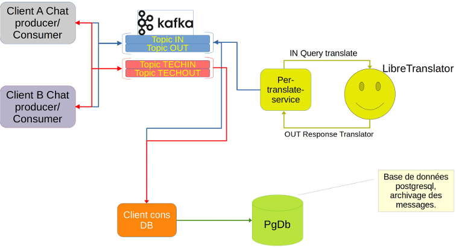

# Projet de Messagerie - Intergiciel

## Équipe du Projet

* **Zammou Aymane**
  
  * Numéro d'étudiant : 22403568
  * Email : aymane.zammou@uphf.fr

* **Louahdi Otman**
  
  * Numéro d'étudiant : 22403514
  * Email : otman.louahdi@uphf.fr

* **Ait-Mimoune Alexandre**
  
  * Numéro d'étudiant : 22404551
  * Email : alexandre.ait-Mimoune@uphf.fr

* **Elarouki Nouhaila**
  
  * Numéro d'étudiant : 22304224
  * Email : nouhaila.elairouki@uphf.fr
    
    

## Outils

Le projet a été developpé en Java avec le Framework Spring Boot pour le client et l' API.

Nous avons aussi du utiliser Kafka, Docker, Libretranslate et PostgreSql afin de réaliser ce projet.


## Objectif du projet

Développement d’une messagerie intra-entreprise souveraine simple avec traduction
automatique des échanges [Anglais, Français] (sans authentification ni cryptage) qui
permettra les actions suivantes





## Description du projet

* **Clients** : chacun peut envoyer et recevoir des messages.
  Ils utilisent chacun:
  
  * `topicout` pour envoyer un message
  * `topicin` pour recevoir une réponse traduite
  * `topictechout` pour envoyer des commandes
  * `topictechin` pour recevoir des réponses techniques

* **per-translate-service** :
  
  * Reçoit les messages du `topicout`
  * Appelle l’API LibreTranslate
  * Renvoie la traduction dans `topicin`

* **LibreTranslate** : service de traduction en HTTP local (d'anglais vers français)

* **Kafka** : est utilisé comme moyen de transmettre les messages entre les services.

* **client-cons-db** :
  
  * Enregistre les messages depuis `topicout` et `topicin`
  * Gère les commandes techniques depuis `topictechout`
  * Publie les réponses dans `topictechin`
  * Stocke les informations dans la base PostgreSQL

* **PostgreSQL** : base de données contenant deux tables principales :
  
  * `message` : messages envoyés et traduits
  * `client_connecte` : clients actifs
    
    
    
    

## Comment lancer le Projet ?

### Etape 1.  Lancement de tous les services

Ouvrir Git Bash dans la racine du Projet puis demarrer tous les services necessaires à l'application 


```bash
./scripts/run_services.sh
```


### Etape 2. Lancement des clients

```bash
./scripts/run_client_A.sh
./scripts/run_client_B.sh
```


### Etape 3. Utiliser l'application

Voici les commandes disponibles et leur utilisation :


| Commande                              | Description                                                                                                                                                     |
|:------------------------------------- |:--------------------------------------------------------------------------------------------------------------------------------------------------------------- |
| `whoami`                              | Affiche les informations du client actuellement connecté dans ce terminal                                                                                       |
| `message --msg "texte" --dst ClientB` | Envoie un message privé à un autre client. Le message sera intercepté, mis en base de données, traduit en français et envoyé au destinataire.                   |
| `traduire --txt "texte en anglais"`   | Permet de traduire manuellement un texte spécifique.                                                                                                            |
| `lister-clients`                      | Demande à la base de données la liste de tous les utilisateurs actuellement connectés au système actuellement.                                                  |
| `byebye`                              | Déconnecte le client de l'application et ferme le terminal.                                                                                                     |
| `enregistrer-client`                  | Commande système permettant d'enregistrer le statut d'un client dans la base de données en le notant comme étant en ligne.                                      |
| `deconnecter-client`                  | Commande système permettant de modifier le statut d'un client en base de données pour signaler qu'il n'est plus disponible mais sans faire quitter le terminal. |
| `is-connected --client ClientB`       | Vérifie si un client spécifique (ici ClientB) est actuellement en ligne.                                                                                        |
| `env`                                 | Affiche les variables d'environnement.                                                                                                                          |


### Etape 4. Fermeture de tous les services

```bash
./scripts/stop_services.sh
```


## Vidéo

Pour appuyer cette explication, voici une vidéo dans laquelle toutes les fonctionnalités de l'application sont testés : 

[Démonstration Projet Messagerie Intergiciel - YouTube](https://www.youtube.com/watch?v=1IB24IjpYCQ)


